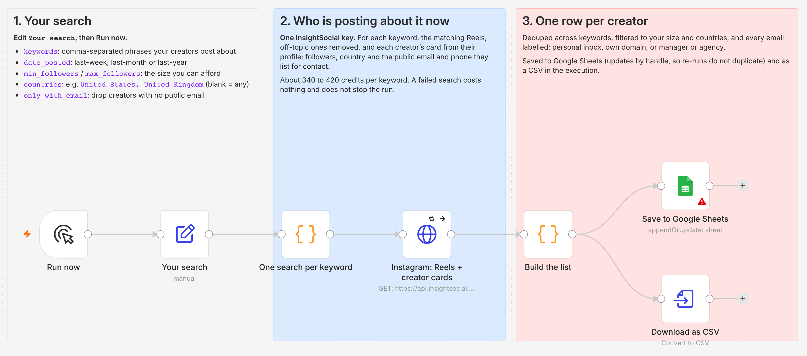

# Creator Outreach List (n8n + InsightSocial)

You type in a few keywords. This workflow finds the Instagram creators who posted Reels about
them this month and gives you one row per creator: followers, country, the reel that matched,
and the **business email and phone they list for contact**. The rows go into Google Sheets and a
CSV file.

On a real run with three keywords, it found 28 creators. 23 of them list a contact email, and 16
of those were in the follower range we asked for. The run cost **1,180 credits**, which works out to
**74 credits per usable creator**.

## What you get

The output of that run is in [`samples/creators-meal-prep.csv`](samples/creators-meal-prep.csv).
It is real and unedited, except that emails and phone numbers are masked before publishing:

| handle | followers | country | email | email_type |
|---|---|---|---|---|
| kalememaybe | 791,195 | United States | c\*\*\*@neonroseagency.com | manager or agency |
| mealprepsandmacros | 360,091 | United States | p\*\*\*@prepwithjess.com | own domain |
| fitnesswithsaz | 213,671 | United Kingdom | s\*\*\*@wmgmt.co.uk | manager or agency |
| jordos_world | 120,187 | United States | l\*\*\*@gmail.com | personal inbox |

Each row also has the profile link, posts count, the keywords it matched, and the matching
reel's link, likes, date and caption.

## Why not just read their bios?

That's the usual way to do it: open each profile and regex the bio for an email. We checked it
against this workflow on the same 28 creators.

- **The bio only has half the emails.** Of the 23 creators with a contact email, 11 had it written
  in their bio. The other 12 put it only behind Instagram's contact button. This workflow reads
  the creator's card, which includes the contact button, so it finds all 23.
- **Many of those emails reach a manager, not the creator.** Of the 16 creators on the list, 5
  route email to a talent manager or agency, such as `@neonroseagency.com` or `@wmgmt.co.uk`.
  Another 8 use a personal Gmail-type inbox, and 3 use their own domain. Each row gets an
  `email_type` label so you can write to a manager differently from a creator.

## How it works

1. **Your search.** The `Your search` node holds your keywords, how recent the Reels must be,
   a follower range, optional countries, and whether to keep only creators with an email.
2. **Who is posting about it now.** For each keyword it makes one call: the matching Reels with
   off-topic ones removed (a free relevance filter) and each creator's card. In our runs the
   filter dropped 2 of 10 Reels for `ai automation` and 4 of 10 for `small business tips`.
3. **One row per creator.** Creators are deduplicated across keywords and filtered by follower
   range and country. Each email is labelled, and the creators with emails sort to the top.
4. **Save.** Rows go to Google Sheets, updating by handle so a re-run doesn't add duplicates.
   They are also saved as a CSV you can download from the execution.

## Cost

One call per keyword to `/v1/instagram/search/reels` with `include=creator`. That is 20 credits
for the search plus about 35 to 40 for each creator card. Failed calls cost nothing.

| Run | Credits | Creators | With email | Kept |
|---|---|---|---|---|
| `meal prep, high protein recipes, healthy breakfast` | 1,180 (420 + 340 + 420) | 28 | 23 | 16 |
| `pilates at home, gut health, small business tips` | 680 (one search failed, free) | 13 | 10 | 9 |

Kept means 10,000 to 1,000,000 followers with an email. Both runs used `last-month`.

Budget **340 to 420 credits per keyword**. The free plan (500 credits a month) covers one keyword
per run. Pro (10,000 a month) covers about 25 keywords. Plans are at
[insightsocial.app/pricing](https://www.insightsocial.app/pricing).

## Setup

1. **Import** [`creator-outreach-list.workflow.json`](creator-outreach-list.workflow.json) into
   n8n (Workflows > Import from File).
2. **InsightSocial key.** Get one at
   [insightsocial.app/portal/api/keys](https://www.insightsocial.app/portal/api/keys). In n8n,
   create a **Header Auth** credential named `InsightSocial API`: set Name to `x-api-key` and
   Value to your key. Select it on `Instagram: Reels + creator cards`.
3. **Google Sheets** (optional). Connect it and pick a spreadsheet whose first row is `handle,
   name, profile_url, followers, country, email, email_type, phone, posts, keywords, reel_url,
   reel_likes, reel_posted, reel_caption, found_on`. If you skip Sheets, delete that node and
   use the CSV.
4. **Your search.** Edit the `Your search` node and click **Execute workflow**. To get the CSV,
   open `Download as CSV` in the execution and click Download.

| Setting | Example | What it does |
|---|---|---|
| `keywords` | meal prep, high protein recipes | One search each, comma separated |
| `date_posted` | last-month | `last-week`, `last-month` or `last-year` |
| `min_followers` / `max_followers` | 10000 / 1000000 | The creator size you can work with |
| `countries` | United States, United Kingdom | The country the creator declares; blank keeps all |
| `only_with_email` | true | Drops creators with no public email |

## Use it responsibly

These are the addresses creators publish so that brands can reach them. They are not consent to
bulk mail. Write to each person about their own work, follow the anti-spam law where they live
(CAN-SPAM, GDPR, CASL), and stop when asked.

## Honest caveats

- **Each keyword returns about 10 Reels.** That is one page, so to get more creators, add more
  keywords rather than repeating one.
- **Country is what the creator declares** on their profile. When a creator hasn't declared one,
  it's blank, and those creators are kept even when `countries` is set.
- **`email_type` is a guess from the domain.** Agencies named like `talent`, `mgmt`,
  `management`, `agency`, `collective`, `marketing` or `entertainment` are caught. One that isn't
  (`@blanketlondon.com`) shows up as "own domain".
- **Searches sometimes fail.** One search can return `503 Capacity is temporarily exhausted`. The
  node retries 3 times and then moves on, so the run finishes with the other keywords and you
  aren't charged for the failure.
- **Follower counts are read during the run**, so they change over time.

## Swap in anything

The search node is a plain REST call, and every endpoint answers with the same JSON envelope.
Every path, parameter and price is at
[`api.insightsocial.app/v1/endpoints`](https://api.insightsocial.app/v1/endpoints), which is free
and needs no key. Check `include=creator` on any endpoint you swap in: that option is what adds
the contact card. Docs: [insightsocial.app/docs](https://www.insightsocial.app/docs).

## License

MIT
